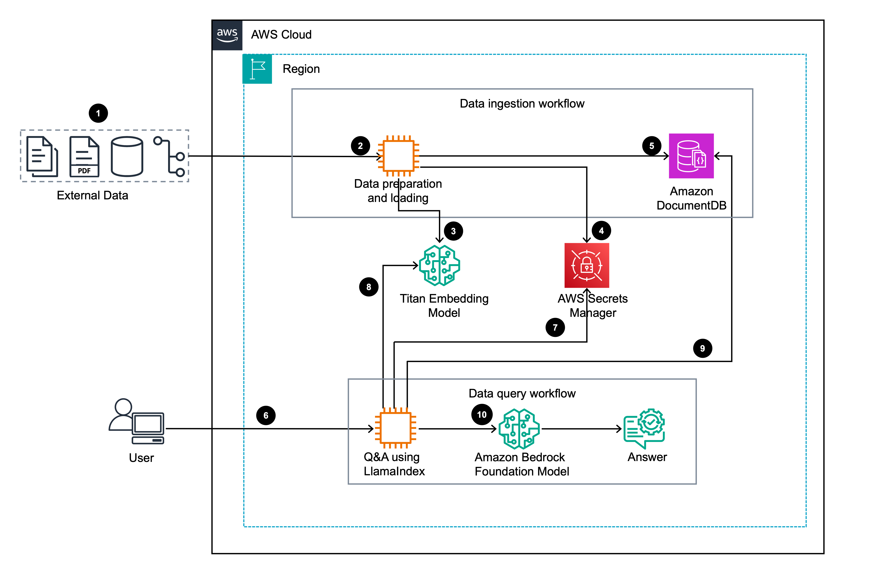

# Guidance for Q&A System with Similarity Search-based Retrieval Augmented Generation (RAG) on AWS

1. [Overview](#overview)
    - [Architecture](#architecture)
    - [Cost](#cost)
2. [Prerequisites](#prerequisites)
   - [Operating System](#operating-system)
3. [Deployment Steps](#deployment-steps)
4. [Running the Guidance](#running-the-guidance)
5. [Next Steps](#next-steps)
6. [Cleanup](#cleanup)
7. [Notices](#notices)
8. [Authors](#authors)

## Overview

Amazon DocumentDB offers native vector search capabilities, enabling you to perform similarity searches with ease. In this guidance, we provide a step-by-step walkthrough that covers all the essential building blocks required to create an enterprise-ready Retrieval Augmented Generation (RAG) application, such as a question-answering (Q&A) system. Our approach leverages a combination of various AWS services, including [Amazon Bedrock](https://aws.amazon.com/bedrock/), an easy way to build and scale generative AI applications with foundation models. We utilize [Titan Text](https://aws.amazon.com/bedrock/titan/) for text embeddings and [Anthropic's Claude ](https://aws.amazon.com/bedrock/claude/) on Amazon Bedrock as our Large Language Model (LLM), while [Amazon DocumentDB (with MongoDB compatibility)](https://aws.amazon.com/documentdb/) serves as our vector database. Additionally, we demonstrate the integration with open-source RAG framework like [LlamaIndex](https://www.llamaindex.ai/), facilitating seamless interfacing with all the components involved.

### Architecture

The  architecture diagram outlines an approach to effectively handle user queries and provide responses. It uses a foundation model available on Amazon Bedrock by employing a Retrieval Augmented Generation (RAG) technique. This approach leverages the vector search capabilities of Amazon DocumentDB and the LlamaIndex framework to retrieve relevant data, thereby enhancing the model's ability to generate contextually appropriate responses.



### How It Works

The Q&A application follows these steps to provide responses to your questions:

1. The Jupyter notebook loads enterprise or external data which lies outside of the large language model’s (LLM) training data to augment the trained model. It can come from various sources including APIs, databases, or document repositories.
2. The notebook preprocesses data by removing inconsistencies and errors, splitting large documents into manageable sections, and chunking the text into smaller, coherent pieces for easier processing. 
3. Notebook generates text embeddings for relevant data using the Titan text embedding models on **Amazon Bedrock**.
4. Notebook fetches credentials from **AWS Secrets Manager** to connect to **Amazon DocumentDB**.
5. Notebook creates a vector search index in **Amazon DocumentDB** and uses LlamaIndex to load the generated text embeddings along with other relevant information into a **DocumentDB** collection.
6. User submits a natural language query for finding relevant answers to Jupyter notebook.
7. Notebook fetches credentials from **AWS Secrets Manager** to connect to **Amazon DocumentDB**.
8. The user’s question is transformed into a vector embedding in notebook using the same embedding model that was used during data ingestion workflow. 
9. Notebook passes the query to LlamaIndex query engine. LlamaIndex is a data orchestration tool that helps with data indexing and querying. LlamaIndex performs a similarity search in the DocumentDB collection using the query embedding. The search retrieves the most relevant documents based on their proximity to the query vector.
10. LlamaIndex query engine augments this retrieved information, along with the user's question as a prompt to the LLM model on **Amazon Bedrock** to generate more accurate and informed responses.

### Cost

_You are responsible for the cost of the AWS services used while running this Guidance. We recommend creating a [Budget](https://docs.aws.amazon.com/cost-management/latest/userguide/budgets-managing-costs.html) through [AWS Cost Explorer](https://aws.amazon.com/aws-cost-management/aws-cost-explorer/) to help manage costs. Prices are subject to change. For full details, refer to the pricing webpage for each AWS service used in this Guidance._

### Sample Cost Table

The following table provides a sample cost breakdown for deploying this Guidance with the default parameters in the US East (N. Virginia) Region for one month.

| AWS service  | Dimensions | Cost [USD/month] |
| ----------- | ------------ | ------------ |
| Amazon DocumentDB Instance Based Cluster | Standard Cluster Configuration, 1 X Instance type (db.r6g.large), Storage (10 GB), I/Os (2 millions), Backup 1 Day | $193.50 |
| Amazon Bedrock - Titan Text Embeddings model | Number of Input tokens (100 million per month) | $10.00 |
| Amazon Bedrock - Anthropic Claude | Number of Input tokens (100 million per month) | $10.00 |
| Amazon SageMaker | Storage (General Purpose SSD (gp2)), Instance name (ml.t3.large), Number of data scientist(s) (1), Number of On-Demand Notebook instances per data scientist (1) | $72.28 |
| AWS Secrets Manager | 1 Secret, 1 million requests/month | $5.40 |

## Prerequisites

1. To utilize [Amazon Bedrock's](https://aws.amazon.com/bedrock/) foundational models, you must first request access to them. This step is a prerequisite before you can start using the Amazon Bedrock APIs to invoke the models. In the following steps, we will configure [model access](https://docs.aws.amazon.com/bedrock/latest/userguide/model-access.html) in Amazon Bedrock, enabling you to build and run generative AI applications. Amazon Bedrock offers a diverse range of foundation models from various providers, including AI21 Labs, Anthropic, Cohere, Meta, Stability AI, and Amazon itself.

#### Amazon Bedrock Setup Instructions
- In the [AWS Console](https://aws.amazon.com/console/), select the Region from which you want to access Amazon Bedrock.
- For this guidance , we will be using the `us-east-1` region.
  

- Search for Amazon Bedrock by typing in the search bar on the AWS console.
  

- Expand the side menu with three horizontal lines (as shown below), select Model access and click on Enable specific models button.
  
  

- For this guidance, we'll be using Anthropic's Claude 3 models as LLMs and Amazon Titan family of embedding models. Click Next in the bottom right corner to review and submit.
  
  
  
- You will be granted access to Amazon Titan models instantly. The Access status column will change to In progress for Anthropic Claude 3 momentarily. Keep reviewing the Access status column. You may need to refresh the page periodically. You should see Access granted shortly (wait time is typically 1-3 mins).
  
  

> [!Note]
> Now you have successfully configured Amazon Bedrock.

2. To deploy this guidance, ensure that the user has permissions to create, list, and modify resources
   - A VPC and the required networking components
   - Amazon DocumentDB
   - Amazon SageMaker
   - AWS Secrets Manager

### Operating System 

These deployment instructions are optimized to best work on Amazon Linux 2 AMI or Mac OS.  Deployment in another OS may require additional steps.

## Deployment Steps

The cloudformation stack can be easily deployed using AWS Console or using AWS CLI and here are the steps for both.

### Using AWS Console
Below are the steps to deploy the Cloudformation temolate using the AWS Console
1. Download the [data-rag-aws-llama-DocumentDB.yaml](deployment/data-rag-aws-llama-DocumentDB.yaml)
2. Navigate to AWS CloudFormation service on your AWS Console
3. Choose ***Create stack*** and select **with new resources (standard)**
4. On **Specify template** choose ***Upload a template file***
5. Enter the **Stack name** for your CloudFormation stack.
6. For **DB cluster username**, enter the name of your administrator user in the Amazon DocumentDB cluster. 
7. For **DB cluster password**, enter the administrator password for your Amazon DocumentDB cluster (minimum 8 characters).
8. Choose **Next**.
9. Select the check box in the **Capabilities** section to allow the stack to create an IAM role, then choose **Submit**.

### Using AWS CLI

1. Clone the repo using command
 
   ```gh repo clone aws-solutions-library-samples/guidance-for-similarity-search-based-retrieval-augmented-generation-on-aws```
   
3. Change directory  to the deplpoyment folder

   ```cd guidance-for-similarity-search-based-retrieval-augmented-generation-on-aws/deployment```
   
4. Create the stack, here is an example command to deploy the stack

   ``` aws cloudformation create-stack --template-body file://data-rag-aws-llama-DocumentDB.yaml --stack-name <StackName> --parameters  ParameterKey=DBUsername,ParameterValue=<DocumentDB_Username> ParameterKey=DBPassword,ParameterValue=<DBPassword_Password>  --capabilities <CAPABILITY_NAMED_IAM> ``` 

## Deployment Validation  

Deployment validation can be done using AWS Console or AWS CLI

### Using AWS Console

1. Open CloudFormation console and verify the status of the template with your stack name provided earlier. The stack creation status should be **CREATE_COMPLETE**
2. If your deployment is sucessful, you should see an active Amazon DocumentDB cluster and Sagemaker running in your account. You can locate the DocumentDB Cluster Endpoint and Sagemaker Notebook URL from outputs tab of Stack.

### Using AWS CLI

1. Open CloudFormation console and verify the status of the template with the name starting with your stack name.
2. If deployment is successful, you should see an active Amazon DocumentDB cluster and Sagemaker instance running in your account.
3. Run the following CLI command to validate the deployment: ```aws cloudformation describe <stack name>```
  
## Running the Guidance

1. Capture the  Amazon DocumentDB cluster endpoint,region name,secret name form Cloudformation outputs tab.
2. Locate and open  Amazon Sagemake Notebook URL form Cloudformation outputs tab.
3. Download IPython notebook [data-rag-aws-llama-docdb.ipynb](source/data-rag-aws-llama-docdb.ipynb)
4. Click on the upload on Notebook instance page and upload the IPython notbook which you downloaded in previos step. 
5. Download the Q3 earnings call [transcript](source/Q3-2024-result-transcript.pdf) of AnyCompany.
6. Now upload the sample transcript on Notebook instance page same as step (4) above
7. Open the IPython notebook  
8. Update the DocumentDB cluster endpoint,region name,secret name on IPython notebook which you captured in step (1)
9. Execute the IPython notebook step by step. 

## Next Steps

You can explore additional sample datasets as well as other Retrieval-Augmented Generation (RAG) frameworks for developing Question and Answer systems. Furthermore, you can experiment with varying the chunk size , LLM hyperparameters to fine-tune the responses generated by the Large Language Model (LLM).

## Cleanup 

### Using AWS Console
1. Navigate to Cloudformation console, locate the stack with the name you provided while creating the stack
2. **Select** the stack and choose **Delete**

### Using AWS CLI
To delete the stack run the following command (replace the stack-name)

``` aws cloudformation delete-stack  --stack-name <StackName> ```

## Notices

*Customers are responsible for making their own independent assessment of the information in this Guidance. This Guidance: (a) is for informational purposes only, (b) represents AWS current product offerings and practices, which are subject to change without notice, and (c) does not create any commitments or assurances from AWS and its affiliates, suppliers or licensors. AWS products or services are provided “as is” without warranties, representations, or conditions of any kind, whether express or implied. AWS responsibilities and liabilities to its customers are controlled by AWS agreements, and this Guidance is not part of, nor does it modify, any agreement between AWS and its customers.*

 
### License

The Q&A System with Similarity Search-based Retrieval Augmented Generationn is released under the [MIT-0 License](https://spdx.org/licenses/MIT-0.html).

## Authors
- Gururaj Bayari
- Anshu Vajpayee

### Contribution
This repository is intended for educational purposes and does not accept further contributions. Feel free to utilize and enhance the app based on your own requirements.
    
